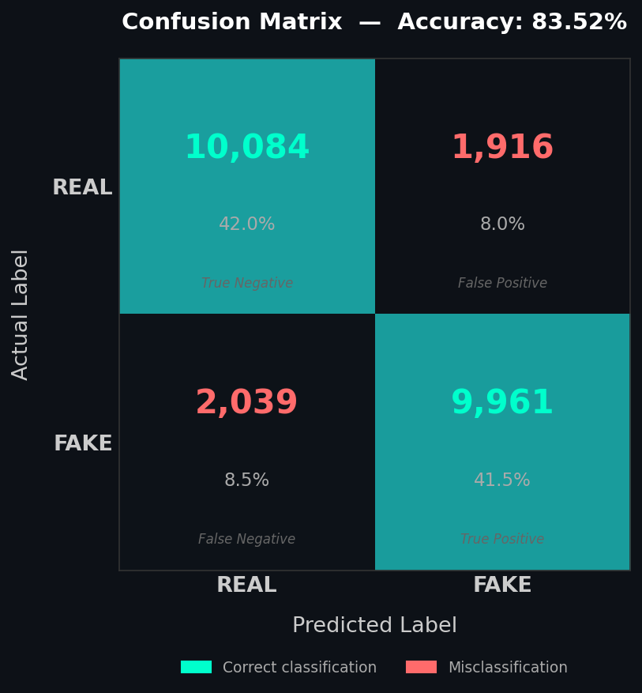

# AI vs Real Image/Video Detector
### VerityWave — Computer Vision Engineer Assessment

A modular Python pipeline that classifies images and videos as **AI-generated** or **Real** using handcrafted feature extraction and a Support Vector Machine (SVM).

---

## Results

| Metric | REAL | FAKE | Overall |
|--------|------|------|---------|
| Precision | 0.83 | 0.84 | 0.84 |
| Recall | 0.84 | 0.83 | 0.84 |
| F1-Score | 0.84 | 0.83 | 0.84 |
| Support | 12,000 | 12,000 | 24,000 |

**Overall Accuracy: 83.52%**

### Confusion Matrix

```
                 Predicted REAL    Predicted FAKE
Actual REAL          10,084              1,916
Actual FAKE           2,039              9,961
```

- True Positives (FAKE correctly identified): **9,961**
- True Negatives (REAL correctly identified): **10,084**
- False Positives (REAL misclassified as FAKE): **1,916**
- False Negatives (FAKE misclassified as REAL): **2,039**

Trained and evaluated on **120,000 images** (60,000 REAL / 60,000 FAKE), 80/20 train-test split.



---

## Approach

The core idea is that real cameras and AI generators produce images through fundamentally different processes. A camera captures light physically — imperfect, noisy, optically constrained. A diffusion model or GAN synthesizes pixels mathematically, and that process leaves measurable fingerprints that are often invisible to the human eye but detectable through signal analysis.

Rather than training a deep network to learn these differences implicitly, this pipeline extracts three explicit, interpretable features that directly capture those fingerprints, then trains an SVM to find the decision boundary between them.

This approach was chosen specifically because it produces explainable predictions — you can look at any flagged image and point to *which* signal triggered the classification.

---

## Features Used

### 1. Frequency Domain Analysis (FFT)

**What it is:** The 2D Fast Fourier Transform decomposes an image into its constituent frequencies — low frequencies represent broad shapes and colors, high frequencies represent fine details and edges.

**Why it works:** AI generators, particularly diffusion models and GANs, have a known artifact: their upsampling and convolutional architecture introduces unnatural patterns in the high-frequency spectrum. Real photographs have a smooth, natural frequency falloff dictated by optics. AI images often show anomalous high-frequency energy spikes that betray their synthetic origin.

**What we extract:** Mean low-frequency energy, mean high-frequency energy, the ratio between them, and the standard deviation of the magnitude spectrum (4 features).

---

### 2. Noise Residual Analysis

**What it is:** Every image contains noise. In real photographs, noise comes from the camera sensor — photon shot noise, thermal noise, read noise. We isolate this noise by subtracting a Gaussian-blurred version of the image from itself, leaving only the residual.

**Why it works:** Real camera noise is spatially random and statistically Gaussian. AI-generated images either have suspiciously clean noise (too little variance) or structured, repetitive noise patterns — neither of which matches the physics of a real sensor. The spatial uniformity of the noise residual is particularly discriminative: real images have uneven noise (more in dark regions, less in bright), while AI images tend toward unnaturally uniform residuals.

**What we extract:** Noise variance, skewness, kurtosis, and spatial uniformity across image quadrants (4 features).

---

### 3. Edge Statistics

**What it is:** Canny edge detection identifies pixel boundaries across the image. We then analyze how those edges are distributed spatially using a 4×4 grid.

**Why it works:** Edges in real photographs follow the physics of light — sharp where focus is sharp, soft where it isn't, concentrated at object boundaries. AI generators tend to produce either over-smoothed edges (blended, lacking sharpness) or unnaturally consistent edges distributed too evenly across the image. The spatial distribution of edge density exposes this.

**What we extract:** Overall edge density, standard deviation of per-cell edge density, mean cell density, and maximum cell density (4 features).

---

## Project Structure

```
veritywave/
├── data/
│   └── CIFAKE/
│       ├── train/
│       │   ├── REAL/
│       │   └── FAKE/
│       └── test/
│           ├── REAL/
│           └── FAKE/
├── models/
│   ├── svm_model.pkl
│   └── scaler.pkl
├── feature_extractor.py   # preprocessing + feature extraction
├── model.py               # SVM training, evaluation, saving
├── predictor.py           # inference on images and videos
├── main.py                # CLI entry point
└── README.md
```

---

## Installation

```bash
git clone https://github.com/yourhandle/veritywave-assessment
cd veritywave-assessment
pip install -r requirements.txt
```

**requirements.txt**
```
opencv-python
numpy
scipy
scikit-learn
joblib
```

---

## Usage

### Train
```bash
python model.py
```

### Predict — Image
```bash
python main.py --input path/to/image.jpg
```

### Predict — Video
```bash
python main.py --input path/to/video.mp4
```

### Output
```json
{
  "prediction": "AI",
  "confidence": 0.91,
  "input": "path/to/image.jpg",
  "type": "image",
  "p_real": 0.09,
  "p_fake": 0.91
}
```

---

## Dataset

**CIFAKE** — 120,000 images (60,000 REAL / 60,000 FAKE) at 32×32 resolution.

- REAL images sourced from CIFAR-10 (real photographs)
- FAKE images generated by Stable Diffusion to match CIFAR-10 classes
- Balanced dataset: no class weighting required
- Images processed at **native 32×32 resolution** — upscaling was deliberately avoided as interpolation introduces artificial pixel patterns that would corrupt feature extraction, particularly FFT

---

## Limitations

**Resolution constraint:** CIFAKE images are 32×32 pixels. While features remain meaningful at this resolution, the FFT frequency bins are coarser and the 4×4 edge grid cells are only 8×8 pixels. Performance would likely improve on higher-resolution datasets.

**Domain specificity:** The model was trained on CIFAR-10 style images (natural scenes, animals, vehicles). Performance on other domains — portraits, art, medical images — is untested and may degrade.

**Generator coverage:** CIFAKE's fake images are exclusively from Stable Diffusion. The model may not generalize equally well to images from other generators (Midjourney, DALL-E, GANs) which have different frequency fingerprints.

**No spatial localization:** The pipeline classifies the whole image as AI or Real. It cannot localize *which region* of an image was AI-generated, which limits usefulness for partially-edited images.

**Video assumption:** Video prediction aggregates per-frame predictions via mean probability. This assumes temporal consistency — a video where only some frames are AI-generated will produce a blended confidence score rather than flagging the specific frames.

**SVM scalability:** SVMs do not scale well beyond ~500k samples. For larger datasets, replacing the SVM with a lightweight neural classifier (MLP or small CNN) on the same feature vectors would be the natural next step.

---

## Design Decisions

**Why SVM over CNN?** The assessment explicitly required feature extraction to be incorporated and explained. An SVM trained on handcrafted features makes every decision interpretable — you can inspect which features drove a classification. A CNN learns its own internal representations, making the feature choice unexplainable. Given that explainability was a graded criterion, SVM was the correct choice here.

**Why these three features?** FFT, noise, and edges each capture a different physical property of image formation. Together they provide complementary signal: FFT captures global frequency structure, noise captures pixel-level statistics, and edges capture local spatial patterns. They are also computationally cheap, requiring no GPU and completing inference in milliseconds per image.

**Why not upscale to 256×256?** Upscaling 32×32 images to 256×256 via interpolation invents pixels. This would corrupt FFT (introducing interpolation artifacts into the frequency spectrum), noise analysis (smoothing the residual), and edge statistics (creating false edges at interpolation boundaries). Native resolution preserves the original signal.

---

*Submitted as part of the VerityWave Computer Vision Engineer Assessment — August 2026 Project*
